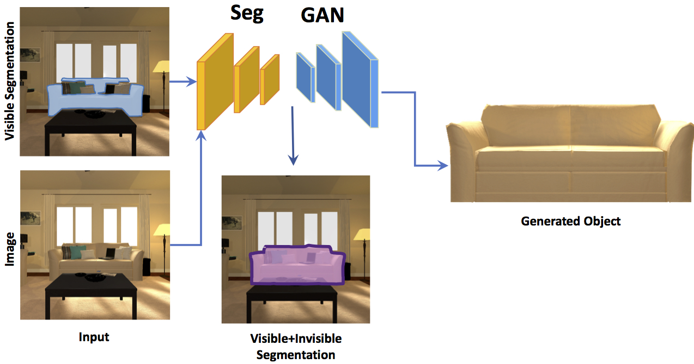
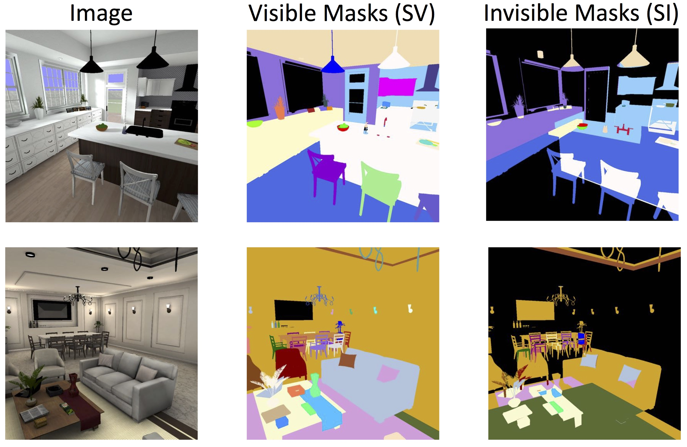

# [SeGAN: Segmenting and Generating the Invisible](https://arxiv.org/abs/1703.10239)
This project is presented as spotlight in CVPR2018.

<center></center>

### Abstract

Humans have strong ability to make inferences about the appearance of the invisible and occluded parts of scenes. For example, when we look at the scene on the left we can make predictions about what is behind the coffee table, and can even complete the sofa based on the visible parts of the sofa, the coffee table, and what we know
in general about sofas and coffee tables and how they occlude each other.

SeGAN can learn to 
<ol>
<li>Generate the <strong class="important">appearance</strong> of the occluded parts of objects,</li>
<li><strong class="important">Segment</strong> the invisible parts of objects,</li>
<li>Although trained on synthetic photo realistic images reliably segment <strong class="important">natural images</strong>,</li> 
<li>By reasoning about occluder-occludee relations infer <strong class="important">depth layering</strong>.
</li>
</ol>

### Citation

If you find this project useful in your research, please consider citing:

	@inproceedings{ehsani2018segan,
	  title={Segan: Segmenting and generating the invisible},
	  author={Ehsani, Kiana and Mottaghi, Roozbeh and Farhadi, Ali},
	  booktitle={CVPR},
	  year={2018}
	}
	

### Prerequisites

- Using Torch 7 and dependencies from [this repository](https://github.com/torch/distro).
- Linux OS
- NVIDIA GPU + CUDA + CuDNN

### Installation

1. Clone the repository using the command:

		git clone https://github.com/ehsanik/SeGAN
		cd SeGAN

2. Download the dataset from [here](https://homes.cs.washington.edu/~kianae/DYCE.tar.gz) and extract it.
3. Make a link to the dataset.

		ln -s /PATH/TO/DATASET dyce_data

4. Download pretrained weights from [here](https://homes.cs.washington.edu/~kianae/weights_segan_cvpr18.tar.gz) and extract it.
5. Make a link to the weights' folder.

		ln -s /PATH/TO/WEIGHTS weights


### Dataset

We introduce DYCE, a dataset of synthetic
occluded objects. This is a synthetic dataset with
photo-realistic images and natural configuration of objects
in scenes. All of the images of this dataset are taken in indoor
scenes. The annotations for each image contain the
segmentation mask for the visible and invisible regions of
objects. The images are obtained by taking snapshots from
our 3D synthetic scenes.

##### Statistics

The number of the synthetic scenes that we use is 11,
where we use 7 scenes for training and validation, and 4
scenes for testing. Overall there are 5 living rooms and 6 kitchens, where 2 living rooms and 2 kitchen are used for
testing. On average, each scene contains 60 objects and the
number of visible objects per image is 17.5 (by visible we
mean having at least 10 visible pixels). There is no common
object instance in train and test scenes.

<center></center>

The dataset can be downloaded from [here](https://homes.cs.washington.edu/~kianae/DYCE.tar.gz).

### Train

To train your own model:

```
th main.lua -baseLR 1e-3 -end2end -istrain "train"
```

See `data_settings.lua` for additional commandline options.

### Test

To test using the pretrained model and reproduce the results in the paper:

<table>
<tr>
<th rowspan="2">Model</th>
<th colspan="3">Segmentation</th>
<th colspan="2">Texture</th>
</tr>
<tr>
<td>Visible &cup; Invisible</td>
<td>Visible</td>
<td>Invisible</td>
<td>L1</td>
<td>L2</td>
</tr>
<tr>
<td>Multipath</td>
<td>47.51</td>
<td>48.58</td>
<td>6.01</td>
<td>-</td>
<td>-</td>
</tr>
<tr>
<td>SeGAN(ours) w/ SV<sub>predicted</sub></td>
<td>68.78</td>
<td>64.76</td>
<td>15.59</td>
<td>0.070</td>
<td>0.023</td>
</tr>
<tr>
<td>SeGAN(ours) w/ SV<sub>gt</sub></td>
<td>75.71</td>
<td>68.05</td>
<td>23.26</td>
<td>0.026</td>
<td>0.008</td>
</tr>
</table>

```
th main.lua -weights_segmentation "weights/segment" -end2end -weights_texture "weights/texture" -istrain "test" -predictedSV
```

For testing using the groundtruth visible mask as input instead of the predicted mask:

```
th main.lua -weights_segmentation "weights/segment_gt_sv" -end2end -weights_texture "weights/texture_gt_sv" -istrain "test"
```


## Acknowledgments
Code for GAN network borrows heavily from [pix2pix](https://github.com/phillipi/pix2pix).
